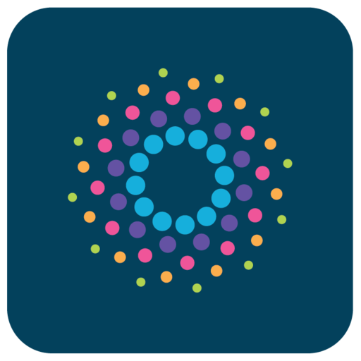
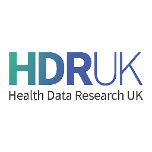
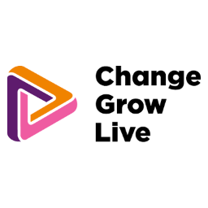
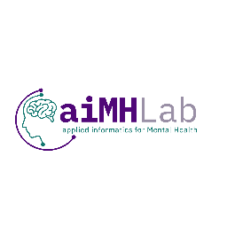
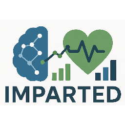
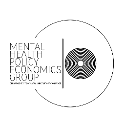
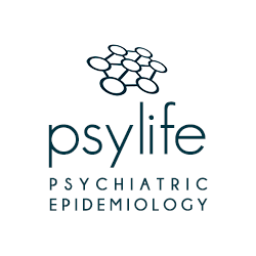

MINDSET is a collaborative research programme bringing together researchers, doctoral students, academic groups, NHS organisations, public-sector data partners, treatment providers, and people with lived experience.

## Research Team

 <b>Dr Justin Yang</b>
 Senior Research Fellow
 Programme Lead
 <a href="https://profiles.ucl.ac.uk/75514-justin-yang">UCL Profile</a>

 <b>Dr Nathalie Rich</b>
 Research Fellow
 <a href="https://profiles.ucl.ac.uk/80231-nathalie-rich">UCL Profile</a>

 <b>Dr Yunsoo Kim</b>
 Research Fellow
 <a href="https://bluesky333.github.io/">Website</a>

## Doctoral Researchers

 <b>Vanessa Cieplinska</b>
 PhD Researcher
 School attendance and educational attainment in children with neurodevelopmental conditions
 <i>Secondary supervisor: Justin Yang</i>

 <b>Alua Yeskendir</b>
 PhD Researcher
 Health and social inequalities in psychiatric disorders
 <i>Secondary supervisor: Justin Yang</i>

I also contribute to doctoral supervision and research development through thesis committees and wider mentoring. Further information is available on the [Teaching and Supervision](../teaching/) page.

## Selected Partnerships

The programme works with organisations whose data, expertise, services, or communities are central to the research questions we address.

<b>Administrative Data Research UK</b> 
My ADR UK Fellowship uses linked health and education data to study inequalities in the experiences and outcomes of neurodivergent children and young people. The programme also supports my wider work on responsible and policy-relevant use of administrative data.

<b>North London NHS Foundation Trust</b> 
I serve as Deputy Lead of the Trust's Research Database, supporting research using routinely collected mental-health records and collaboration across UCL, NHS clinicians, informatics teams, researchers, and public contributors.

<b>DATAMIND</b> 
I work with DATAMIND through the UKRI Mental Health Platform, developing research that links mental-health data science with questions about severe mental illness, inequalities, clinical records, and wider population data.

<b>Complex Emotions Hub</b> 
Through WISDOM, I collaborate with the Complex Emotions Hub to investigate how relationships, emotional experiences, adversity, and other socioemotional factors may shape trajectories into and through severe mental illness.

<b>Social Health Hub</b> 
My work with the Social Health Hub contributes to WISDOM's focus on the social conditions and experiences that shape severe mental illness and its course over time.

<b>Health Data Research UK</b> 
I contribute to the HDR UK Mental Health Driver Programme, helping shape national work on the use of health data for mental-health research and connecting methodological, infrastructure, and applied research priorities across partner organisations.

<b>South London and Maudsley NHS Foundation Trust</b> 
I work with colleagues at SLaM to harmonise research access across the North London and South London CRIS infrastructures, including approaches that make cross-site replication and comparative studies easier to conduct using routinely collected mental-health records.

<b>Change Grow Live</b> 
Change Grow Live is a partner in UNITED, contributing treatment-provider expertise, public involvement, site-based learning, and research support to work aimed at improving the use of national addiction-treatment data.

<b>Turning Point</b> 
Turning Point is a partner in UNITED, supporting engagement with treatment services and people with lived experience and helping ensure that work on national treatment data remains relevant to practice and service delivery.

## Research Collaborations

MINDSET also connects with complementary research groups whose methodological and substantive expertise strengthens the programme.

<b>applied informatics for Mental Health</b> 
Collaboration around electronic health records, clinical data science, digital methods, and the use of intensive longitudinal data in mental-health research.

<b>Exploring Mental Illness Using Systems Thinking</b> 
Collaboration around psychiatric epidemiology, social and environmental determinants of mental health, and inequalities affecting marginalised populations.

<b>Improving Mental and Physical health Analytics through RobusT Epi and Data sci</b> 
Collaboration around causal inference, electronic health records, inequalities, and physical-health outcomes among people with severe mental illness.

<b>Mental Health | Policy | Economics Group</b> 
Longstanding collaboration spanning psychiatric epidemiology, substance use, health inequalities, policy, and population-health research.

<b>PsyLife</b> 
Collaboration around population and social epidemiology, psychosis, causal inference, and inequalities in the determinants and outcomes of severe mental illness.

