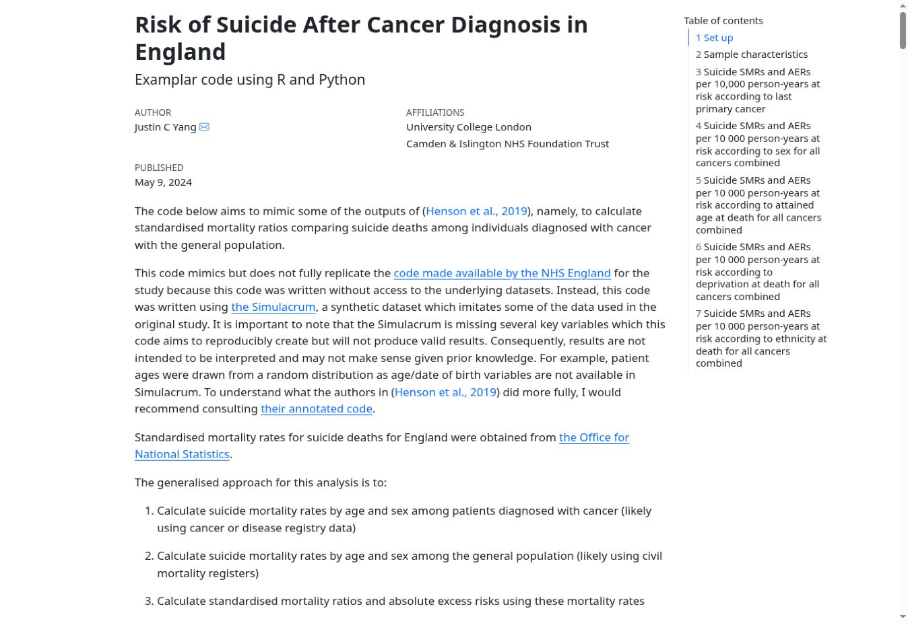
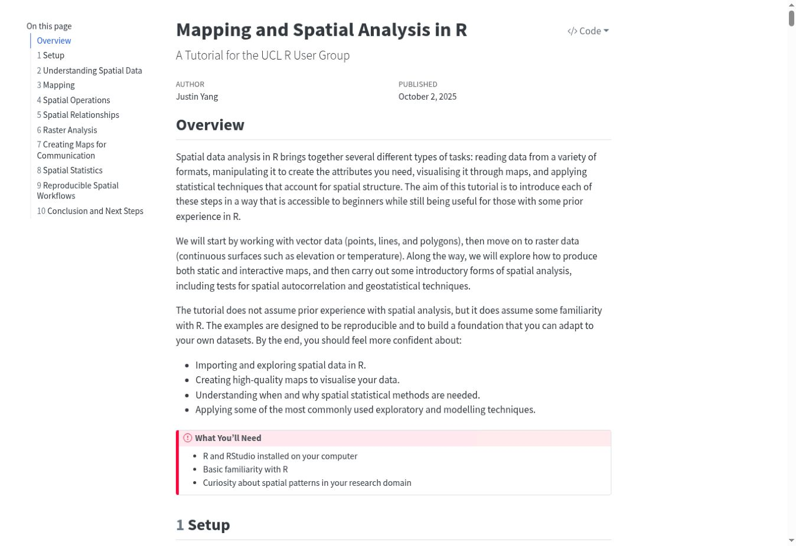
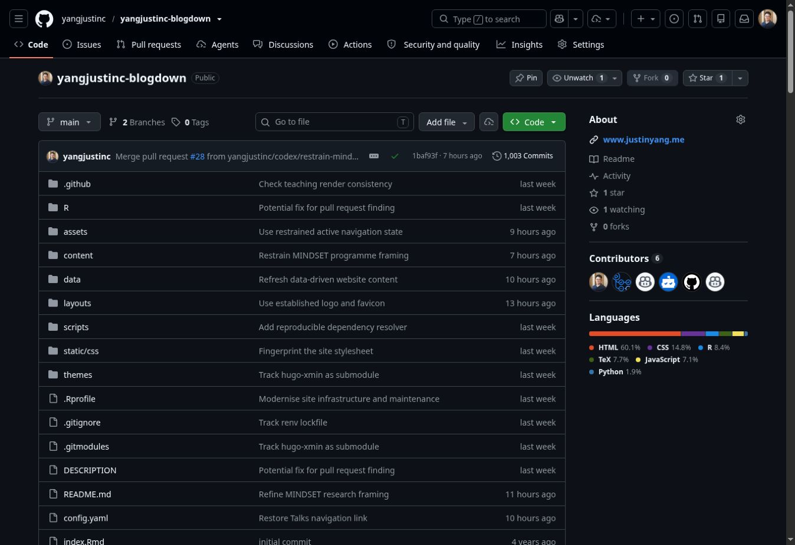

Open and reproducible research is part of how I work, particularly where methods, analytical code, and teaching materials can be reused beyond a single study. Selected resources are listed below. Where a stable release is available, I provide a Zenodo DOI so that the resource can be cited independently of the live GitHub repository.

## Research code

<article class="resource-feature">
  <a class="resource-feature-preview resource-feature-code" href="https://github.com/yangjustinc/hopesen" aria-label="Open HOPESEN analytical code on GitHub">
    ECHILD · R
    <strong>HOPESEN</strong>
    linked administrative data reproducible analysis
  </a>
  

    <h2>HOPESEN: SEND provision and secondary-school outcomes</h2>
    
<a href="https://github.com/yangjustinc/hopesen"><b>HOPESEN</b></a> provides the analytical code supporting population-based analyses of recorded special educational needs and disabilities (SEND) provision profiles and education and health outcomes among secondary-school pupils in England using the ECHILD Research Database.

    
The public repository is a cleaned and pedagogical implementation of the completed analysis, including linked-data cohort construction, outcome derivation, descriptive analyses, and functionalised fixed-effects Poisson regression workflows designed for use within the ONS Secure Research Service. It also documents the practical constraints of reproducible analysis in an air-gapped trusted research environment.

    
<a href="https://github.com/yangjustinc/hopesen">Source code and documentation</a> · <a href="https://doi.org/10.5281/zenodo.22710433">Archived v1.0.0 release and DOI</a>

  

</article>

## Teaching and methods resources

<article class="resource-feature">
  
  

    <h2>Routine data analysis across R, Python, and Stata</h2>
    
<a href="https://yangjustinc.github.io/2024-ncras/"><b>Risk of Suicide After Cancer Diagnosis in England</b></a> is a worked teaching resource demonstrating approaches to analysing routinely collected health data. It covers survival-analysis workflows, person-time, standardised mortality ratios, and absolute excess risks, with examples in R, Python, and Stata.

    
The material uses synthetic and published data for methodological and educational purposes. <a href="https://github.com/yangjustinc/2024-ncras">Source code and documentation</a> · <a href="https://doi.org/10.5281/zenodo.22710447">Archived v1.0.0 release and DOI</a>

  

</article>

<article class="resource-feature">
  
  

    <h2>Mapping and spatial analysis in R</h2>
    
<a href="https://yangjustinc.github.io/2025-mapping-and-spatial-analysis-in-r/"><b>Mapping and Spatial Analysis in R</b></a> is an introductory tutorial developed for the UCL R User Group. It covers spatial data structures, coordinate reference systems, vector and raster analysis, mapping, spatial joins, proximity and adjacency, spatial autocorrelation, hotspot analysis, and introductory spatial interpolation.

    
The tutorial is designed for researchers and analysts with basic R experience who are new to spatial analysis. <a href="https://github.com/yangjustinc/2025-mapping-and-spatial-analysis-in-r">Source materials</a> · <a href="https://doi.org/10.5281/zenodo.22710469">Archived v1.0.0 release and DOI</a>

  

</article>

## Open infrastructure

<article class="resource-feature">
  
  

    <h2>Reproducible website infrastructure</h2>
    
The <a href="https://github.com/yangjustinc/yangjustinc-blogdown"><b>MINDSET website source</b></a> is public. The site uses Hugo, R, ORCID, OpenAlex, Crossref, GitHub Actions, and small curated data files to maintain publications, funding, talks, teaching, and other academic content with limited manual duplication.

    
The repository documents the build, dependency-management, content-refresh, and validation workflow.

  

</article>

## More code, talks, and materials

Additional public repositories are available through my [GitHub profile](https://github.com/yangjustinc), and selected academic and methods presentations are listed under [Talks & Presentations](../talks/).

Project-specific code and materials are also linked from the relevant [research](../research/), [publication](../publications/), and [teaching](../teaching/) pages where available.
